# Reactor Standalone Compiling Guide

Reactor Standalone was developed using the [Xojo IDE](https://www.xojo.com/) which is a cross-platform compatible development toolset. Xojo allows you to compile macOS, Windows and Linux builds of a program at the same time. This makes it manageable for a small development team to create and release desktop apps. Xojo does not charge any royalties for compiled apps which makes life simple.

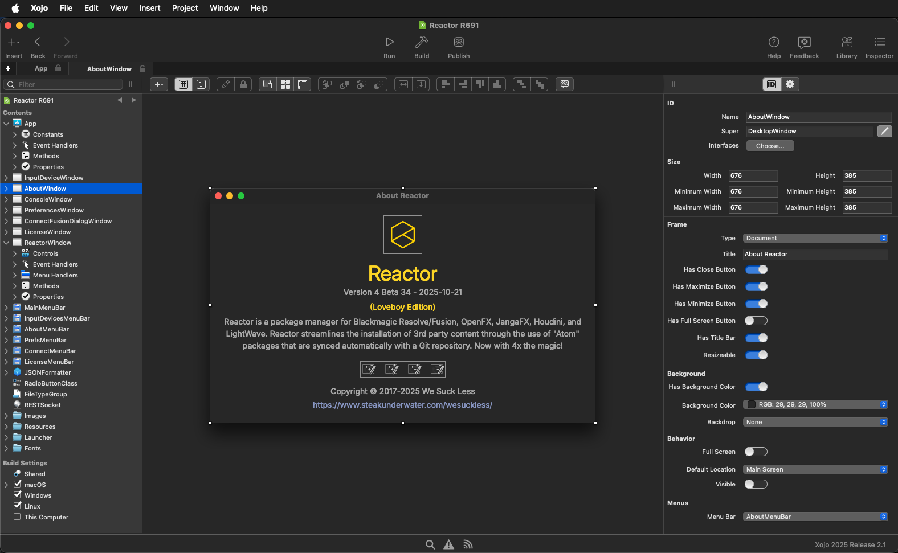

Xojo uses an object-oriented version of the BASIC programming language. The [full Xojo API documentation](https://documentation.xojo.com/index.html) can be read online. If you've ever used a Commodore 64 with [Commodore BASIC](https://en.wikipedia.org/wiki/Commodore_BASIC), or a PC with [QBasic](https://en.wikipedia.org/wiki/QBasic), or Windows and [Visual Studio](https://en.wikipedia.org/wiki/Visual_Studio) in the past you are 50% of the way there for mastering Xojo's programming syntax.

## Download Xojo

Xojo allows anyone to download a free version of the IDE that allows you to write code and run it inside the debugging environment. It is possible to run compiled Xojo programs on ARM, and Intel CPUs. You can even run Xojo on a Raspberry PI, iOS device, or Android device.

The download page for Xojo [can be found here](https://www.xojo.com/download/).

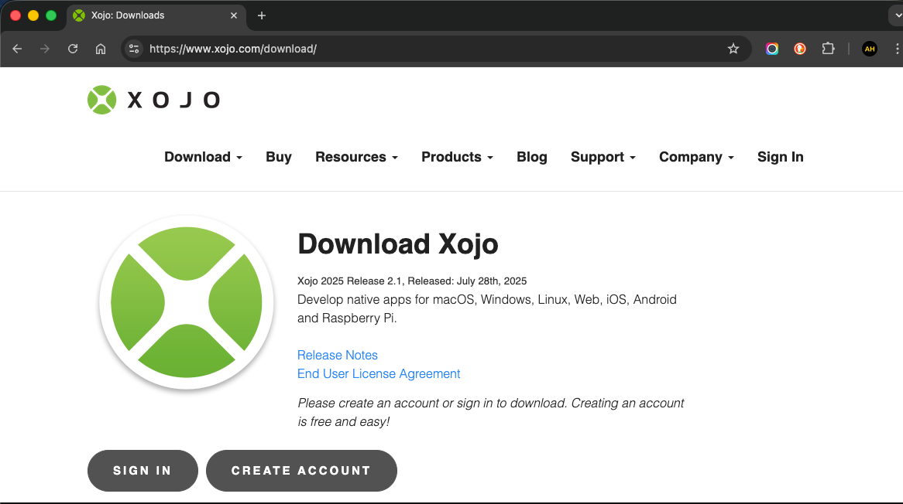

For commercial usage, the Reactor Standalone project has a 3-seat license of the "[Xojo Pro](https://www.xojo.com/store/)" IDE that can be installed and used on any OS platform with a floating license. Xojo Pro allows desktop and command line programs to be compiled, as well as mobile apps. Anyone developing code for the Reactor Standalone project can check out one of the 3-seat licenses as needed.

## Xojo Plugins

The Reactor Standalone project has licenses of the [Monkeybread Software Xojo Complete Plugins](https://www.monkeybreadsoftware.de/xojo/plugins.shtml) which give us access to just about every single programming API function that exists natively on Windows, macOS, and Linux. This allows everything from adding Python scripting support to a Xojo compiled app, Scintilla code syntax highlighting in your app, Windows tray item creation, custom root level menu bars, and more. 

With Monkeybread's plugin, if something can be done with either C++, C#, or ObjectiveC and the native OS APIs, you also can do it using Xojo, too. The [MBS Plugin documentation](https://www.monkeybreadsoftware.net/) covers over 80,000 API functions you can access and use. The MBS Xojo Complete Plugins [can be downloaded here](https://www.monkeybreadsoftware.de/xojo/download/plugin/MBS-Xojo-Plugins254.zip). 

1. Start by downloading the MBS zip file
2. Expand the zip archive
3. The MBS ".xojo_plugin" files are then copied into the "/Applications/Xojo 2025 Release 2.1/Plugins/" folder on macOS, or the similar Xojo Plugins folder on Windows, or the Xojo Plugins folder on Linux.

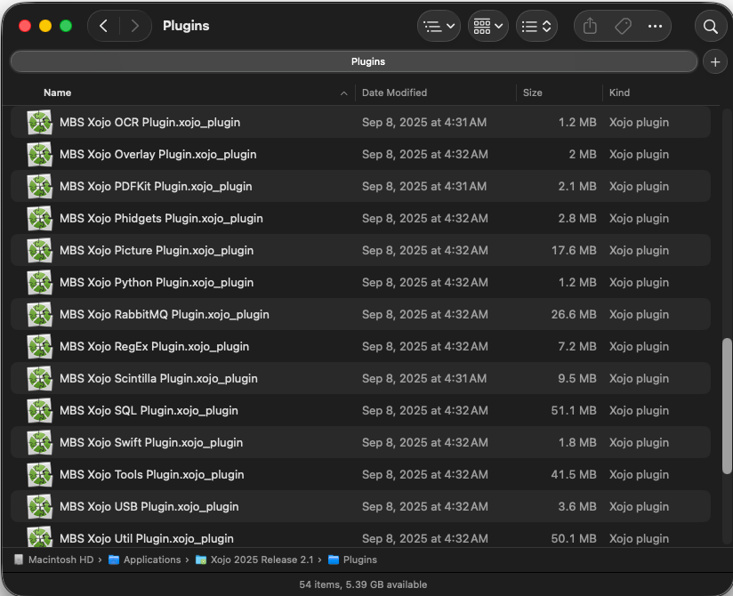

Note: The first time you run Xojo and compile a program, after installing the MBS plugins, will take some patience. Subsequent times will be much faster as the plugins are cached.

### MBS Plugin Licensing

The MBS plugin typically has the license key added to the source code in the Xojo "App.Opening" event. This makes the compiled Reactor Standalone app able to run with all MBS features enabled.

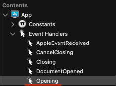

Note: You have to be careful when sharing the plain-text Xojo source code to remove your license key data before posting the source code on GitHub publicly or the key can be stolen and used by 3rd parties. When the program is compiled the MBS resources are automatically copied into the programs' application bundle folder.

Note: Xojo is be able to run the MBS plugins in a free unlicensed trial mode. This happens when the Reactor Standalone source code is compiled without a license key present in the Xojo source code. In this case you will simply see a nag dialog when the compiled app is run but you can fully develop and edit the source code.

## Xojo Project File Format

Currently Xojo 2025 Release 2.1 is used. The Xojo project file is saved as an XML project. This setting is defined the "Xojo Settings > General > Default project format" window.

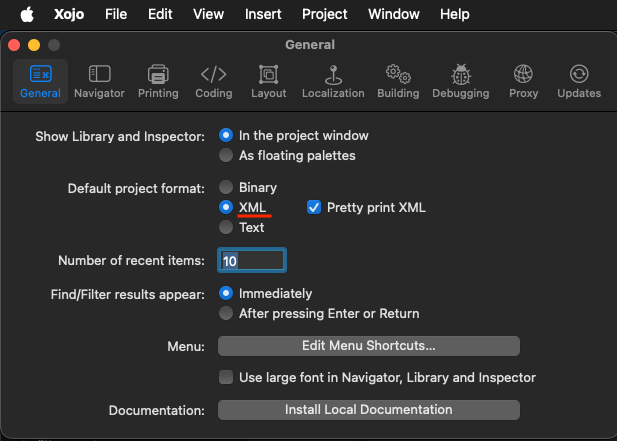

Currently an incrementing number is appended to the Xojo project file name. This number is updated each time a major change happens to the Reactor Standaline source code. This makes it easy to revert changes and know how far back you have to go.

`$HOME/Xojo Reactor/Reactor R691.xojo_xml_project`

## Relinking Xojo Project File Assets

When you move a Xojo project file between macOS/Windows/Linux development systems it will ask you to relink the assets it can't automatically find. This is typically the bundled windows launcher shortcuts for LightWave 2025, the icon resources, and linked JSON files.

These assets are all found in the locally synced Reactor-app GitHub repo folder. Look for the assets inside the "Reactor-App/Sources/Xojo/" sub-folder.

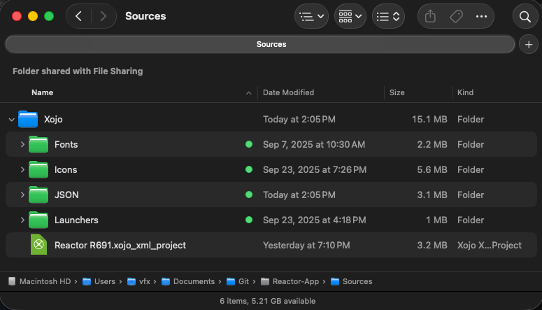

## Compiling a Xojo Project

Start by opening your Xojo project file.

On the left sidebar at the bottom of the list of entries, is a "Build Settings" section. Cross-platform code compiling is as simple as enabling the checkboxes next to each of the OS platforms you want to support.

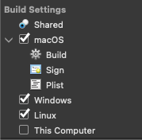

Then you press the "Build" button in the toolbar at the top of the Xojo window to compile the programs.

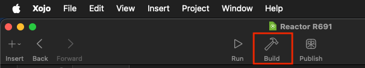

After a few minutes the compiled output will be placed next to the location of your project file on disk, in a new sub-folder named "`Builds - <Your Project Name>`".

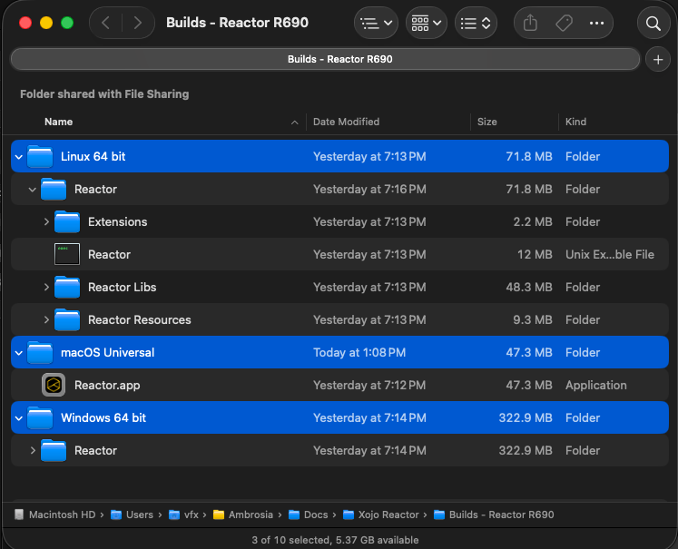

### macOS Code Signing

Apple macOS code signing settings are accessed by clicking on in the "Build Settings -> MacOS -> Sign" section on the left sidebar.

The "Developer ID" text field is where you add your Apple Developer code signing ID.

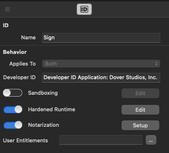

The "Hardened Runtime" and "Notarization" options need to be enabled. This is part of the code-signing process.

In the "Notarization" dialog an [app-specific password](https://support.apple.com/en-us/102654) is used. This avoids security issues from occurring with password reuse.

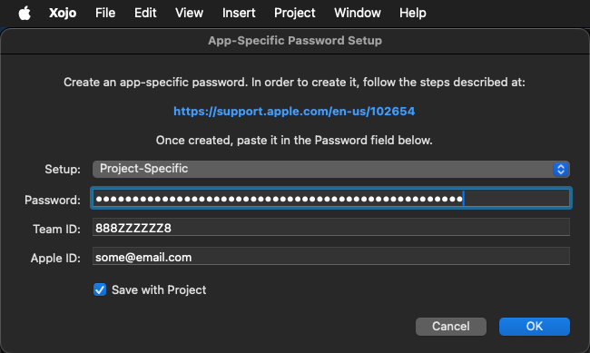

After the Reactor Standalone for macOS program is compiled an extra step in the macOS Terminal window is used to further harden the security of the build. This step sends the compiled program to Apple where they scan the executable on their side and send back a notarization approval in 5-15 minutes that is hard coded to the application's checksum.

```bash
{
cd '$HOME/Xojo Reactor/Builds - Reactor R690/macOS Universal'

codesign -f -o runtime --timestamp -s "Developer ID Application: <Enter Your Actual Dev ID Here>" ./Reactor.app

hdiutil create -volname MyApp -srcfolder ./Reactor.app -ov -format UDBZ ./Reactor_Standalone_4_Beta_Mac.dmg

codesign -s "Developer ID Application: <Enter Your Actual Dev ID Here>" --timestamp ./Reactor_Standalone_4_Beta_Mac.dmg

xcrun notarytool submit --apple-id "andrew@doverstudios.com" --team-id "<Enter Your Actual Team ID Here>" --password "<Enter Your Apple App-Specific Password Here>" ./Reactor_Standalone_4_Beta_Mac.dmg
}
```

The resulting program will be found inside a disk image at a path like:

`$HOME/Xojo Reactor/Builds - Reactor R690/macOS Universal/Reactor_Standalone_4_Beta_Mac.dmg`

Double-click on the disk image to mount it. The "Reactor.app" file in this disk image is ready to run.

## Packaging the Releases

The release files are saved to a local folder with the naming convention:

`Reactor Standalone/Releases/<YYYY-MM-DD> Beta <Number>/reactor-for-linux-x64-v4-beta-<Number>`
`Reactor Standalone/Releases/<YYYY-MM-DD> Beta <Number>/reactor-for-mac-universal-v4-beta-<Number>`
`Reactor Standalone/Releases/<YYYY-MM-DD> Beta <Number>/reactor-for-win-x64-v4-beta-<Number>`

In this case `<Number>` means a beta release value like "33".
In this case `<YYYY-MM-DD>` means a date like "2025-10-21".

### HTML Docs

The included "Docs" folder has Markdown formatted documentation. This info is sourced from a git sync of the [Reactor Standalone GitHub repo](https://github.com/Kartaverse/Reactor-Standalone). The Markdown content has been converted to HTML using a shell script that runs the ["cmark" command-line tool](https://github.com/commonmark/cmark).

The Docs folder content looks like:

```
Install.html
Images/
index.html
ChangeLog.html
OpenFXUsage.html
HoudiniUsage.html
Hotkeys.html
FusionUsage.html
LightWaveUsage.html
BetaNotes.html
ChangeLog.md
README.md
OpenFXUsage.md
LICENSE
Install.md
HoudiniUsage.md
Hotkeys.md
FusionUsage.md
LightWaveUsage.md
BetaNotes.md
```

The `Readme.md` file is converted to an HTML document named `index.html`. In the original `Readme.md` file it has links to .md files for the other documents so the content is readable on the [Reactor Standalone GitHub repo](https://github.com/Kartaverse/Reactor-Standalone) webpage. For the purpose of the Markdown to HTML output, those .md links are find & replaced so they point at ".html" files which makes the weblinks valid when viewed locally in a web browser.

Source Markdown text:

```
## Table of Contents

- [Installation](Install.md)
- [Fusion Usage](FusionUsage.md)
- [Houdini Usage](HoudiniUsage.md)
- [LightWave Usage](LightWaveUsage.md)
- [OpenFX Usage](OpenFXUsage.md)
- [Hotkeys](Hotkeys.md)
- [Beta Notes](BetaNotes.md)
- [Change Log](ChangeLog.md)
```

Find & Replaced HTML links in the Markdown text:

```
## Table of Contents

- [Installation](Install.html)
- [Fusion Usage](FusionUsage.html)
- [Houdini Usage](HoudiniUsage.html)
- [LightWave Usage](LightWaveUsage.html)
- [OpenFX Usage](OpenFXUsage.html)
- [Hotkeys](Hotkeys.html)
- [Beta Notes](BetaNotes.html)
- [Change Log](ChangeLog.html)
```

### Linux Releases

1. Copy the "Reactor" folder to the `reactor-for-mac-universal-v4-beta-<Number>` folder.
2. Add the Markdown to HTML converted "Docs" folder to the `reactor-for-mac-universal-v4-beta-<Number>` folder.
3. Add the "Fonts" folder content to the `reactor-for-mac-universal-v4-beta-<Number>` folder.
4. Add the "Atomz List Sample" content to the `reactor-for-mac-universal-v4-beta-<Number>` folder.
5. Add the "Reactor Standalone.desktop" shortcut to the `reactor-for-mac-universal-v4-beta-<Number>/Reactor/` folder.

### macOS Releases

1. Copy the code-signed "Reactor.app" file to the `reactor-for-mac-universal-v4-beta-<Number>` folder.
2. Add the Markdown to HTML converted "Docs" folder to the `reactor-for-mac-universal-v4-beta-<Number>` folder.
3. Add the "Fonts" folder content to the `reactor-for-mac-universal-v4-beta-<Number>` folder.
4. Add the "Atomz List Sample" content to the `reactor-for-mac-universal-v4-beta-<Number>` folder.

### Windows Releases

1. Copy the "Reactor" folder to the `reactor-for-mac-universal-v4-beta-<Number>` folder.
2. Add the Markdown to HTML converted "Docs" folder to the `reactor-for-mac-universal-v4-beta-<Number>/` folder.
3. Add the "Fonts" folder content to the `reactor-for-mac-universal-v4-beta-<Number>/` folder.
4. Add the "Atomz List Sample" content to the `reactor-for-mac-universal-v4-beta-<Number>/` folder.
5. Add the "Reactor Standalone.lnk" shortcut to the `reactor-for-mac-universal-v4-beta-<Number>/Reactor/` folder.

## Zip Packaging the Releases

The individual Linux, Mac, and Windows folders are compressed as zip archives. The zip tool is set to automatically exclude invisible files like thumbs.db (Windows) and .DS_Store (MacOS).

On macOS I've been using the free zip utility called [Keka](https://www.keka.io/en/) as it has a handy set of controls for "[x] Exclude Mac resource forks" and [x] Archive items separately" which make it fast to drag and drop the folders on to zip and everything happens instantly.

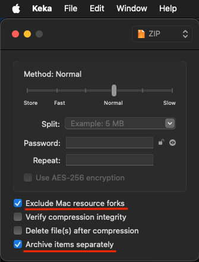

## Atom Package JSON Workflows

Reactor Standalone has moved to using a JSON formatted Atom document for syncing the atom packages from the GitLab repo. 

1. The initial atom packages are still created/validated with the Atomizer GUI and a standard .atom file is saved to disk as the starting point.

2. Then the "Atomz Create" atom package provided Python scripts are run from inside of Fusion Studio/Resolve/Resolve Studio session to output a "Reactor.json" file that is saved into the GitLab repos "JSON" folder.

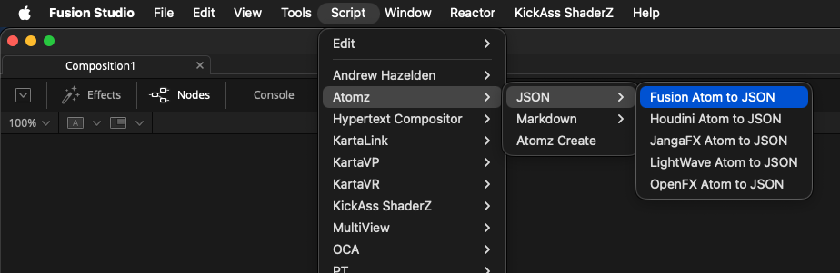

This JSON document has every single atom package for a specific Reactor GitLab repo appended into a single file. This means one network request for the "Reactor.json" file can download all of the atom description data, instead of needing 500+ single file requests for atoms to be made with individual network socket connections.

Here is an example of the Reactor.json file structure:

```
{
    "1": {
        "__ctor": "Atom",
        "Version": 1.0,
        "Deploy": {
            "1.0": "scripts/Python/Layout/Utility/hello_reactor.py"
        },
        "Name": "HelloReactor",
        "Category": "Scripts",
        "Date": {
            "__flags": 256,
            "1.0": 2025.0,
            "2.0": 9.0,
            "3.0": 23.0
        },
        "Author": "Andrew Hazelden",
        "Description": "<h1>LightWave Scripts</h1>\n<p>A simple python script for LightWave Layout that prints the words \"Reactor says Hello, World!\". The script is known as \"Reactor Hello World\" in the LW user interface.</p>\n\n<p>The output from the script can be seen here:<br/>\n\n",
        "Zipfile": "https://gitlab.com/WeSuckLess/Reactor-for-LightWave/-/archive/main/Reactor-for-LightWave-main.zip?path=Atoms/com.AndrewHazelden.Scripts.HelloReactor",
        "ID": "com.AndrewHazelden.Scripts.HelloReactor"
    }
}
```

An interesting note with this Reactor.json file is the "Zipfile" attribute provides the direct download HTTPS link URL for GitLab to deliver a per-atom package zipped download. This means all of the atom package resources are live bundled by GitLab into a single file download as an "Atomz" package that can be saved to disk, and used in a later offline install on an air-gapped TPN (Trusted Partner Network" compilant setup at a studio.

3. A Reactor Standalone "Highlights.json" file is saved to the GitLab repo's "JSON" folder as well. This provides each GitLab repo with a custom news feed for Reactor users to see in the right panel of the Reactor user interface.

Here is an example of the Highlights.json file structure:

```
{
    "1": {
        "Title": "Welcome to Reactor",
        "ImageURL": "https://gitlab.com/WeSuckLess/Reactor/-/raw/master/JSON/Highlights-1.png?ref_type=heads",
        "Blurb": "Reactor's official spokesmonkey Charlie presents a guided tour of what's possible.",
        "ShowRelatedName": "YouTube Playlist",
        "ShowRelatedURL": "https://www.youtube.com/playlist?list=PLVDcRvd92hcgtYFgiiJtWUWEKJH0Op8W9",
        "DiscussName": "(WeSuckLess Forum)",
        "DiscussURL": "https://www.steakunderwater.com/wesuckless/viewtopic.php?t=7426"
    },
    "2": {
        "Title": "Vonk Mograph Fuse",
        "ImageURL": "https://gitlab.com/WeSuckLess/Reactor/-/raw/master/JSON/Highlights-2.png?ref_type=heads",
        "Blurb": "The vMograph tools are the next generation of Vonk Ultra technology that help power dynamic motion graphics. Create data driven graphics with the help of a large collection of modifier nodes, and a fuse-based 2D and 3D vector rendering engine.",
        "AtomName": "Vonk Mograph",
        "AtomID": "com.Vonk.FusionMograph",
        "ShowRelatedName": "Instagram Channel",
        "ShowRelatedURL": "https://www.instagram.com/vonkultra/",
        "DiscussName": "(WeSuckLess Forum)",
        "DiscussURL": "https://www.steakunderwater.com/wesuckless/viewtopic.php?t=7426"
    },
    "3": {
        "Title": "STMapper Fuse",
        "ImageURL": "https://gitlab.com/WeSuckLess/Reactor/-/raw/master/JSON/Highlights-3.png?ref_type=heads",
        "Blurb": "A DCTL/GPU powered Fuse for all your STmap needs.",
        "AtomName": "STMapper",
        "AtomID": "com.JacobDanell.STMapper",
        "ShowRelatedName": "Instagram Channel",
        "ShowRelatedURL": "https://www.instagram.com/emberlightvfx/",
        "DiscussName": "(WeSuckLess Forum)",
        "DiscussURL": "https://www.steakunderwater.com/wesuckless/viewtopic.php?t=7426"
    },
    "4": {
        "Title": "PROPAGATE Script",
        "ImageURL": "https://gitlab.com/WeSuckLess/Reactor/-/raw/master/JSON/Highlights-4.png?ref_type=heads",
        "Blurb": "PROPAGATE is a utility that captures parameter changes on the active node and applies them to other selected nodes, keeping settings, connections, expressions, and animations consistent across a selection.",
        "AtomName": "PROPAGATE",
        "AtomID": "com.DominikBargiel.Propagate",
        "ShowRelatedName": "YouTube Channel",
        "ShowRelatedURL": "https://www.youtube.com/watch?v=yT1KqW1dVRw",
        "DiscussName": "(WeSuckLess Forum)",
        "DiscussURL": "https://www.steakunderwater.com/wesuckless/viewtopic.php?p=56240#p56240"
    }
}
```
